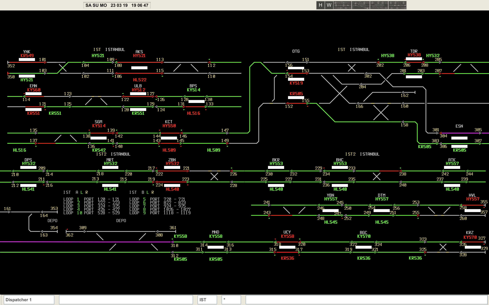

# DispatchStation
DispatchStation is a web based simulation of the interlocking and ATS system which is being used in the M1 line of Istanbul metro.

The fixed block Bombardier (now Alstom) CITYFLO 250 system is being simulated.

Users can dispatch trains and open routes using the built in commands.

For more info and help, visit the project's [website](https://dispatchstation.baranonen.com).